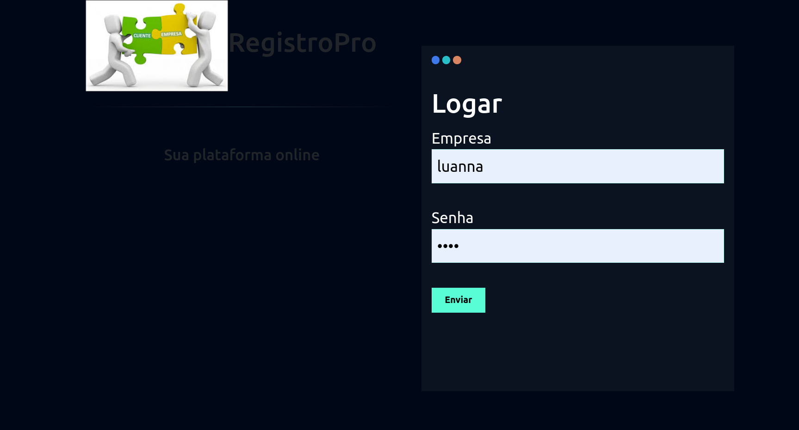

## RegistroPro - Banco de cadastro para empresas e usuários
## .plataforma on-line.

# README - Projeto de Cadastro de Funcionários Vinculados a Empresas

Este projeto consiste em uma aplicação **Django** que permite gerenciar empresas e seus funcionários. Além do cadastro, é possível exportar os dados dos funcionários para um arquivo **Excel** (utilizando a biblioteca **Pandas**). A aplicação está organizada em dois aplicativos (apps) principais:

- **empresas**: Responsável pelo cadastro e autenticação de empresas (usuários).
- **funcionarios**: Responsável pelo cadastro e gerenciamento de funcionários.

---

## Sumário

1. [Visão Geral](#visão-geral)  
2. [Principais Tecnologias](#principais-tecnologias)  
3. [Estrutura de Pastas](#estrutura-de-pastas)  
4. [Configuração e Instalação](#configuração-e-instalação)  
5. [Execução do Projeto](#execução-do-projeto)  
6. [Funcionalidades Principais](#funcionalidades-principais)  
   - [Cadastro de Empresas](#cadastro-de-empresas)  
   - [Login/Logout de Empresas](#loginlogout-de-empresas)  
   - [Cadastro de Funcionários](#cadastro-de-funcionários)  
   - [Exportação de Funcionários para Excel](#exportação-de-funcionários-para-excel)  
7. [Exemplos de Código](#exemplos-de-código)  
   - [Views do app `empresas`](#views-do-app-empresas)  
8. [Contribuindo](#contribuindo)  
9. [Licença](#licença)  

---

## 1. Visão Geral

O projeto **cadastro_funcionarios** fornece um sistema onde cada empresa (usuário) pode se cadastrar, fazer login e gerenciar os funcionários vinculados a ela. As principais operações são:

- **Cadastro de empresa**: Cria um novo usuário no sistema, representando a empresa.  
- **Login**: Autentica a empresa para gerenciar seus funcionários.  
- **Cadastro de funcionário**: Registra um funcionário, especificando nome, cargo, salário, data de admissão, senioridade (conectada a uma categoria) e carta de apresentação.  
- **Exportação para Excel**: Exporta todos os funcionários em um arquivo `.xlsx` usando a biblioteca **Pandas**.  

---

## 2. Principais Tecnologias

- **Linguagem**: Python (3.x)  
- **Framework Web**: Django (4.x ou versão compatível)  
- **Biblioteca para Planilhas**: Pandas (para manipulação e exportação de dados em Excel)  
- **Banco de Dados**: SQLite (padrão do Django)
- **HTML/CSS**: Para criação dos templates do Django.  

---

## 3. Estrutura de Pastas

A estrutura de pastas do projeto segue o padrão:

cadastro_funcionarios -> projeto
│
├── app empresas/
│ │
├── app funcionarios/
│  │
├── core cadastro_funcionarios/

## 4. Configuração e Instalação

1. **Clonar o repositório**:

   git clone https://github.com/seu-usuario/cadastro_funcionarios.git

2. **Criar ambiente virtual**:

    python -m venv venv
    source venv/bin/activate  # Linux/Mac
    venv\Scripts\activate     # Windows

3. **Instalar dependências**:
    pip install django pandas

4. **Aplicar migrações**:
    python manage.py makemigrations
    python manage.py migrate

5. **Execução do projeto**:
    python manage.py runserver

## 6. Funcionalidades Principais

### 6.1 Cadastro de Empresas

- A empresa se cadastra informando um **username** e uma **senha**, que são gerenciados via `User` do Django.  
- Após o cadastro bem-sucedido, é possível realizar o login.


### 6.2 Login/Logout de Empresas

- O login é feito com as credenciais informadas no cadastro (**username** e **senha**).  
- Após logar, a empresa tem acesso às funcionalidades de cadastro de funcionários e exportação.  
- O logout encerra a sessão atual.




### 6.3 Cadastro de Funcionários

- A empresa logada pode cadastrar quantos funcionários desejar, informando:  
  - **Nome**  
  - **Cargo**  
  - **Salário**  
  - **Data de Admissão**  
  - **Senioridade** (selecionada a partir de categorias predefinidas no banco)  
  - **Carta de Apresentação** (opcional)


### 6.4 Exportação de Funcionários para Excel

- É possível exportar todos os funcionários cadastrados em um arquivo **.xlsx** por meio de um botão no formulário de cadastro de funcionários.  
- A exportação é feita usando **Pandas** para transformar os dados em um *DataFrame* e salvá-los no arquivo.

## 7. Exemplos de Código

### 7.1 Views do app empresas (views.py)
```python
from django.shortcuts import render, redirect
from django.contrib.auth.models import User
from django.contrib.messages import constants
from django.contrib import messages
from django.contrib import auth

def cadastrar_empresa(request):
    if request.method == "GET":
        return render(request, 'cadastrar_empresa.html')
    elif request.method == "POST":
        username = request.POST.get('username')
        senha = request.POST.get('senha')
        confirmar_senha = request.POST.get('confirmar_senha')

        if senha != confirmar_senha:
            messages.add_message(request, constants.ERROR, 'Acesso inválido!')
            return redirect('/empresas/cadastrar_empresa')
        
        # Verifica se a empresa (usuário) já existe
        user = User.objects.filter(username=username)
        if user.exists():
            messages.add_message(request, constants.ERROR, 'Empresa já cadastrada!')
            return redirect('/empresas/cadastrar_empresa')

        try:
            User.objects.create_user(username=username, password=senha)
            return redirect('/empresas/logar_empresa')
        except:
            messages.add_message(request, constants.ERROR, 'Erro do servidor!')
            return redirect('/empresas/cadastrar_empresa')

def logar_empresa(request):
    if request.method == 'GET':
        return render(request, 'logar_empresa.html')
    elif request.method == "POST":
        username = request.POST.get('username')
        senha = request.POST.get('senha')

        user = auth.authenticate(request, username=username, password=senha)
        if user:
            auth.login(request, user)
            messages.add_message(request, constants.SUCCESS, 'Logado!')
            return redirect('/funcionarios/cadastrar_funcionario/')
        else:
            messages.add_message(request, constants.ERROR, 'Username ou senha inválidos')
            return redirect('/empresas/logar_empresa')

def logout(request):
    auth.logout(request)
    return redirect('/empresas/logar_empresa')
```

## 8. Contribuindo

Contribuições são bem-vindas! Siga os passos abaixo:

1. **Faça um fork** do repositório  
2. **Crie uma branch** para sua feature (`git checkout -b feature/nova-feature`)  
3. **Faça o commit** das suas alterações (`git commit -m 'Minha nova feature'`)  
4. **Faça o push** para sua branch (`git push origin feature/nova-feature`)  
5. **Abra um Pull Request** neste repositório  

---

## 9. Licença

Sinta-se livre para utilizá-lo e modificá-lo de acordo com suas necessidades.

**Contato**: Caso tenha dúvidas ou sugestões, fique à vontade para abrir uma issue ou entrar em contato.

*Obrigada por usar o sistema RegistroPro!*
